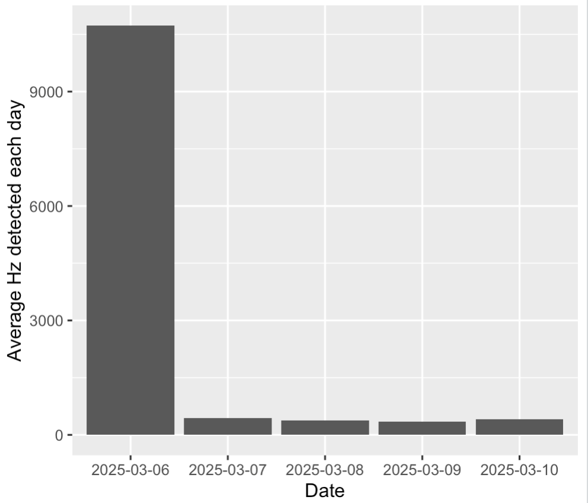

# mothitoR 

## Summary

This package is built for the Insect Ecology Lab at Smith College. The purpose of this package is to summarize and visualize a synthesized data set that includes moon light data as well as light data from the Macleish Field Station. This package aims to aid in the investigation of how light pollution and moon light play a role in the prevalence of moths caught by the mothitor. 

## Installation

The current version of `mothitoR` can be installed by:

``` r
remotes::install_github("CDarling25/mothitoR")
```

You can load this package by:

``` r
library(mothitoR)
```

## Data Set

mothitoR contains a data set containing the following columns of data:

- UTC Date & Time
- Local Date & Time
- Temperature
- Counts
- Frequency
- MSAS
- Area - Ratio of illuminated area of moon's surface. 1.0 means maximum (full), and 0.0 means completely dark (new).
- Category - Numerical description of moon's phase. Its range is 0-7 and matches this description.

    - 0 = 🌑 (New Moon).

    - 1 = 🌒 (Waxing Crescent Moon).

    - 2 = 🌓 (First Quarter Moon).

    - 3 = 🌔 (Waxing Gibbous Moon).

    - 4 = 🌕 (Full Moon).

    - 5 = 🌖 (Waning Gibbous Moon).

    - 6 = 🌗 (Last Quarter Moon).

    - 7 = 🌘 (Waning Crescent Moon).

- Phase - Ratio of current moon cycle using next_new_moon relative to previous_new_moon and ephem Python's library. 0.0 would mean the phase just started and 1.0 it ended. Therefore, 0.5 means full moon, 0.25 First Quarter Moon and 0.75 Last Quarter Moon.

This data set can be accessed by the following code:

``` r
moon_light
```

Columns for moon data and their descriptions were sourced from [isaacbernat's moon-data repository](https://github.com/isaacbernat/moon-data/tree/main) 

## Functions

### avg_light

This function takes in a start and end date (as strings) and will return a summary table for Macleish light data each day in the interval. If no start and end date is passed in, the function will output average Macleish light data for each day in the data set.

Ex:

``` r
avg_light("2025-03-04", "2025-03-10")
```

### light_by_moon

This function returns general data about how light varies depending on moon metrics. light_by_moon takes in a metric (Category, Phase, Area) and outputs the associated Macleish light data. If no metric is passed, the function will take Category as its default metric. 

Ex:

``` r
light_by_moon(Phase)
```

### moon_light_visualizer

This function takes in a start and end date as strings and returns a visual of how the average light varies each day within the provided date range. This visual is then shown to the user

Ex: 
```r
moon_light_visual("2025-03-06", "2025-03-10")
```
#

## Contributors

- [Cameron Darling](https://github.com/CDarling25)
- [Molly Daniel](https://github.com/mollyd13)
